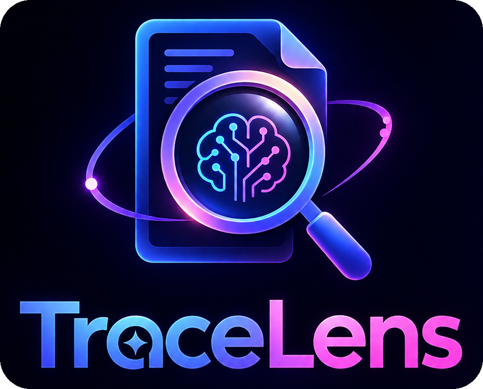

<p align="center"></p>

# TraceLens

> Turn documents into evidence. Turn evidence into insight.

## Overview

TraceLens is a web application for investigating collections of documents. Instead of reading files one by one, an investigator sees the entities, relationships, dated events, contradictions, anomalies and missing records across the whole collection, and can open the exact passage, page and section behind every finding.

It is aimed at investigators, auditors, compliance teams, journalists, legal researchers and anyone who has more documents than time.

## Problem Statement

**Challenge:** ALGOXILLA, ALG-AI-02, Intelligent Document Investigator.

Information that matters is spread across contracts, emails, statements and ledgers. A denial on page 8 of one file and a transfer on page 3 of another are easy to miss when read by hand. Existing AI document tools mostly summarize one file or answer chat questions, which makes it hard to see how pieces of evidence connect and hard to verify where an answer came from.

## Our Solution

TraceLens treats the collection as one evidence system:

**documents → evidence → entities → relationships → events → contradictions → timeline → investigation → explainable conclusion**

Every finding carries evidence IDs, so a conclusion can be traced back through *Finding → Claim → Evidence → Source → Location → Entity → Event*. Findings use cautious wording ("potential contradiction", "possible anomaly", "requires human verification"). TraceLens does not make legal or criminal judgments, and the investigator stays in control through review actions.

## Key Features

* **Evidence graph:** interactive graph with drag, zoom, pan, type filters, node search, path highlighting, and the evidence behind every relationship.
* **Contradiction detection:** side-by-side claims with sources, why they conflict, severity, an explained confidence level, and recommended next checks.
* **Evidence gap analyzer:** finds documents the evidence refers to that are not in the uploaded set, such as a missing delivery confirmation.
* **Chain of evidence and citations:** every answer, graph edge, timeline event and report row links to the source passage.
* **Timeline, anomalies and entities:** reconstructed chronology, amount outliers and repeated references, and entity profiles with mention counts and relationships.
* **Cited investigator chat:** answers are assembled only from retrieved passages, and it replies "I couldn't find sufficient evidence" when nothing supports an answer.
* **Human review:** verify, dismiss, flag, tag and annotate evidence, add manual entity links, and mark contradictions resolved.
* **Reports and presentation:** investigation report (HTML, JSON, CSV, print to PDF), a guided Presentation Mode, and a light/dark theme.
* **Synthetic demo:** a fully populated fictional case, "Orion Procurement Review", labeled as synthetic data.

## How It Works

1. Open the app and choose **Explore Demo**, or **Start Investigation** to add your own files.
2. The overview shows documents, evidence items, entities, relationships, events, contradictions, anomalies and gaps. Each number opens the items behind it.
3. Explore the graph, timeline and contradictions. Click any citation to open the original passage with its entities highlighted.
4. Ask the Investigator a question, such as "What evidence connects Rajiv Mehta to Orion Systems?", and open the cited sources.
5. Review findings (verify, dismiss, note, resolve), then generate and export the report.

## Architecture

```
Browser (static site, no build step)
 ├─ Demo investigation  → precomputed, same schema as analyzer output
 ├─ Local analyzer      → TXT/CSV/MD/JSON parsed in the browser
 ├─ Retrieval + chat    → keyword, synonym and entity match → ranked evidence → cited answer
 └─ Views               → overview, documents, evidence, entities, graph, timeline,
                          contradictions, anomalies, gaps, chat, reports

Optional FastAPI backend
 ├─ POST /api/extract   → validate upload → extract text (PDF, DOCX, OCR) → return text
 ├─ Retrieval module    → same approach as the browser, over the demo case
 └─ Demo-case API       → serves demo_data/orion_case.json
```

* **Frontend:** plain JavaScript modules loaded by `index.html`, with a custom force-directed SVG graph. No frameworks or runtime dependencies.
* **Local analysis:** regex-based entity extraction, passage-level evidence, co-mention relationships, dated events, IQR-based amount outliers, duplicate-passage detection, a negation-based contradiction heuristic, and detection of referenced-but-missing documents.
* **Data flow:** every stage emits structured records (entity, evidence, relationship, event, contradiction, anomaly, gap) that reference evidence IDs. Findings without evidence IDs are not produced.
* **Backend:** a thin FastAPI layer over pure-Python modules for validation, extraction and retrieval. Nothing is stored by `/api/extract`.
* **Designed but not connected:** LLM claim reasoning, embeddings with pgvector, authentication and server-side persistence. See [`docs/ARCHITECTURE.md`](docs/ARCHITECTURE.md) and [`backend/db/schema.sql`](backend/db/schema.sql).

## Tech Stack

| Layer    | Technology |
| -------- | ---------- |
| Frontend | HTML, CSS and JavaScript (no framework, no build step); custom SVG graph; Google Fonts (Schibsted Grotesk, Source Serif 4) |
| Backend  | Python 3.12, FastAPI, Uvicorn, Pydantic, python-multipart, python-docx, PyMuPDF (optional pytesseract for OCR) |
| Database | None is used at runtime. A PostgreSQL + pgvector schema is provided for future persistence. Review notes are stored in the browser's local storage. |
| Tools    | Docker, Vercel (frontend hosting), Render (backend hosting), Python `unittest` |

## Project Structure

```
tracelens/
├── frontend/
│   ├── index.html
│   ├── config.js              # set TRACELENS_API_URL to enable the backend
│   ├── vercel.json
│   ├── assets/                # styles.css, logo and favicon files
│   └── src/
│       ├── data.js            # synthetic demo investigation
│       ├── analyze.js         # derived indexes, confidence, local analyzer
│       ├── core.js            # state, helpers, routing, evidence drawer
│       ├── views.js           # page views
│       ├── graph.js           # force layout and SVG graph
│       ├── chat.js            # retrieval, investigator, report, exports
│       └── main.js            # shell, landing, theme, upload, presentation mode
├── backend/
│   ├── app/                   # main.py, config.py, validation.py, extract.py, retrieval.py
│   ├── tests/test_core.py
│   ├── db/schema.sql
│   ├── requirements.txt
│   └── Dockerfile
├── demo_data/orion_case.json
├── docs/                      # ARCHITECTURE.md, DEMO_SCRIPT.md
├── .env.example
├── render.yaml
└── vercel.json
```

## Getting Started

### Prerequisites

* **Frontend only:** any modern browser, and Python 3 (or any static file server) to serve the folder.
* **Backend (optional):** Python 3.10+; Tesseract is needed only for image OCR.

### Installation

The frontend needs no installation. For the backend:

```bash
cd backend
python3 -m venv .venv
source .venv/bin/activate        # Windows: .venv\Scripts\activate
pip install -r requirements.txt
```

### Environment Variables

Copy `.env.example` and set values for the backend. Secrets are read only by the backend and never sent to the browser.

| Variable | Purpose |
| -------- | ------- |
| `ALLOWED_ORIGINS` | Comma-separated frontend origins allowed by CORS |
| `MAX_UPLOAD_MB` | Upload size limit (default 15) |
| `AUTH_SECRET` | Long random string used to sign login tokens. Set it, or sessions end whenever the server restarts |
| `AUTH_DB_PATH` | SQLite file for user accounts (default `tracelens_users.db`). Use a persistent disk in production |
| `DATABASE_URL` | Reserved for future persistence; not used yet |
| `LLM_API_KEY`, `EMBEDDING_API_KEY` | Reserved for future AI reasoning; not used yet |

The frontend reads one setting, `window.TRACELENS_API_URL`, from `frontend/config.js`. Leave it empty to run entirely in the browser.

### Run Locally

```bash
# Frontend
cd frontend
python3 -m http.server 5173        # open http://localhost:5173

# Backend (optional, in a second terminal)
cd backend
uvicorn app.main:app --reload --port 8000    # API docs at http://localhost:8000/api/docs
```

To use the backend from the frontend, set `window.TRACELENS_API_URL = 'http://localhost:8000'` in `frontend/config.js` and set `ALLOWED_ORIGINS=http://localhost:5173`.

## Sign-in

The app opens on a login page (logo, email, password with a Show/Hide toggle). After signing in you land on the landing page. **Sign out** is on the landing page and in the sidebar.

* **With a backend** (`TRACELENS_API_URL` set): accounts are stored on the server (`/api/auth/register`, `/api/auth/login`, `/api/auth/me`). Passwords are hashed with PBKDF2-SHA256 and a per-user salt, login tokens are HMAC-signed and expire after 7 days, login attempts are rate limited, and `/api/extract` requires a valid token.
* **Without a backend:** accounts are kept in this browser only (hashed with PBKDF2 via WebCrypto). This is a convenience gate, not security, because anyone with access to the browser profile can clear it.

## Usage

* **Judges / quick tour:** click **Explore Demo**, or press **Presentation mode** for a guided walkthrough. A step-by-step script is in [`docs/DEMO_SCRIPT.md`](docs/DEMO_SCRIPT.md).
* **Your own files:** click **Start Investigation** and sign in (or create an account), then add TXT, CSV, Markdown, JSON, PDF, DOCX or image files (up to 15 MB each). They are read and analyzed in your browser; they are only sent to a server if you configure a backend.
* **Ask questions:** open Investigation Chat. Try a connection question, "Find all payments above ₹5 lakh", or an unrelated question to see the insufficient-evidence reply.
* **Review and export:** use the review controls in the evidence panel, then generate a report under Reports.
* **Theme:** use the sun/moon button; the choice is remembered.

## Screenshots

> **To complete before submission:** add screenshots to `docs/screenshots/` and link them here. Suggested set: landing page, overview, evidence graph with an open relationship, contradiction detail, timeline, investigator answer with citations, report, and the light theme.

## Testing

**Backend unit tests** (validation, extraction, retrieval):

```bash
cd backend
python3 -m unittest discover -s tests -t .
```

Result when last run during development: 9 tests, all passing. This covers upload validation (bad type, empty, oversize, fake PDF), TXT/CSV/DOCX extraction, corrupt DOCX handling, and retrieval (connection question with citations and contradiction note, amount filtering, insufficient-evidence reply).

**Frontend logic** was checked during development with a Node script that rendered every page for both the demo and an uploaded file, ran the investigator on sample questions, and generated the report, CSV and JSON. All checks passed. That script is not included in this repository.

**Not verified:** the HTTP layer of the backend has not been started in the build environment, and the interface has not been checked in a real browser by the author of this README. Please run a manual pass using `docs/DEMO_SCRIPT.md` before relying on it.

## Deployment

Both services have free tiers. Detailed steps:

* **Frontend (Vercel):** import the repository, set **Root Directory** to `frontend`, framework preset **Other**, leave build and output settings empty, and deploy. Netlify, Cloudflare Pages and GitHub Pages also work because the site is static.
* **Backend (Render, optional):** create a Blueprint from the repository; `render.yaml` builds `backend/Dockerfile`. Set `ALLOWED_ORIGINS` to the frontend URL, check `/api/health`, then put the API URL into `frontend/config.js` and redeploy the frontend. Free instances sleep when idle, so the first request can be slow.

**Live URL:** `[add after deploying]`

## Limitations

* Analysis of uploaded files is rule-based. Entity detection is pattern-based and can miss or mislabel names, and contradiction detection on uploads is a heuristic that flags negated statements about the same parties.
* The demo investigation's findings are precomputed, not generated at runtime.
* There is no LLM reasoning, embedding search, or server-side storage of investigations yet. Accounts exist (see Sign-in below), but investigations and review notes live in the browser only. Review notes live in the browser only.
* PDF, DOCX and OCR uploads need the backend, which is optional and has not been run end to end in the build environment.
* Upload limit is 15 MB per file, both in the browser and on the backend. Very large files take longer to analyze, and the graph is still designed for tens to low hundreds of nodes.
* The graph is built for tens to low hundreds of nodes, not very large networks.
* Security is basic input validation. It is not enterprise-grade.

## Future Improvements

* LLM-based claim extraction and cross-document contradiction reasoning with citation checks.
* Embedding search with pgvector blended into the current hybrid retrieval.
* Authentication, per-investigation isolation and persistent storage.
* Collaborative review and audit trail.
* Scalable graph rendering and more document formats.
* Port the frontend to a component framework with automated browser tests.

## AI and Third-Party Acknowledgements

* **AI-assisted development:** the application code, documentation and demo dataset were produced with the help of Claude (Anthropic). The team is responsible for reviewing and verifying the result.
* **No AI model runs inside the application today.** Entity extraction, retrieval and chat answers use deterministic rules.
* **Libraries (backend):** FastAPI, Uvicorn, Pydantic, python-multipart, python-docx, PyMuPDF (AGPL-3.0, check compatibility with your chosen license), optional pytesseract.
* **Fonts:** Schibsted Grotesk and Source Serif 4 via Google Fonts (SIL Open Font License).
* **Assets:** the TraceLens logo was supplied by the team; favicon sizes were generated from it with Pillow.
* **Data:** the demo case is entirely fictional and synthetic. Names, companies and amounts are invented. No external datasets are used.

## Team

| Name | Contribution |
| ---- | ------------ |
| `[add name]` | `[add contribution]` |

## License

`[add license, or remove this section]`. Note that PyMuPDF is AGPL-3.0 licensed, which may affect the license you can choose for a deployed backend.
